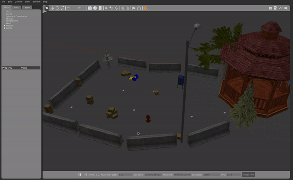

<h1>Homework 3</h1>

Anna Garverick

<h2>Part I: Differential Drive</h2>

This package spawns a differential drive bot that will drive forwards and flip over itself in a gazebo world.

To run the simulation, launch the launchfile ddrive.launch from the diff_drive package.

    roslaunch diff_drive ddrive.launch
    
To start the turtle, call the Resume service.    
    
    rosservice call /Resume

The turtle may be paused with the Pause service, as resumed again with the same Resume service.
    
    rosservice call /Pause
    rosservice call /Resume

The specifications of the robot may be adjusted in the robot_params.yaml file. The dimensions and mass of the body and wheels are controlled through parameters in this file. 

Longer Video: https://youtu.be/OywEfLBxLX4

<h2>Part II: Motion Planning </h2>

<h3>MoveIt / RViz</h3>
<h3>Gazebo</h3>

'Behind the Scenes': https://youtu.be/OdsFyToxo4Q

<h3>Real</h3>
https://youtu.be/NZ8W95a07rM

